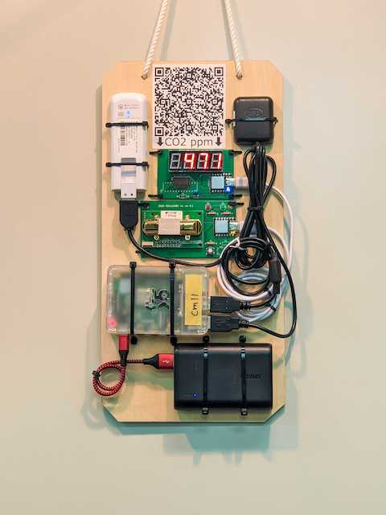
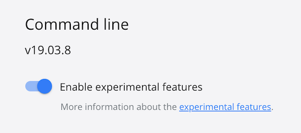

# thmon



Hec-EyeにつながるCO2モニタ

## デプロイ

### Dockerの設定

Docker.appの設定から、`Command Line > Enable Experimental features`を有効にしておく必要があります。




### RaspberryPiのセットアップ

microSDの書き込み

```sh
./write_sd.sh
```

起動してシェルログインできたら、以下のコマンドを実行する。
（Ethernetなど、安定した回線で実行するのがおすすめ）

```
export GITHUB_USERNAME=<your username>
export NEW_HOSTNAME=<new hostname>
curl -s https://raw.githubusercontent.com/realglobe-Inc/thmon/master/setup_raspberrypi.sh | sh -s
```

### アプリケーションのデプロイ

- `deploy.sh`を実行すると、ビルド、転送、ペアリング、緯度経度の設定が行われる
- `target`はssh接続先として有効な文字列
- 設置したい場所の`lat`と`lng`を知るには、[地理院地図](https://maps.gsi.go.jp/)や[OpenStreetMap](https://www.openstreetmap.org/)を使うとよい

```sh
brew install pv  # 最初の1回のみ
./deploy.sh <target> <paring_url> <lat> <lng>
```

```sh
# 例
./deploy.sh pi@raspberrypi.local https://demo.hec-eye.jp/a/625c2d59bXXXXXXXX 35.70161 139.75318
```

## 開発

開発者向けの情報は [DEVELOPMENT.md](DEVELOPMENT.md) を見てください
